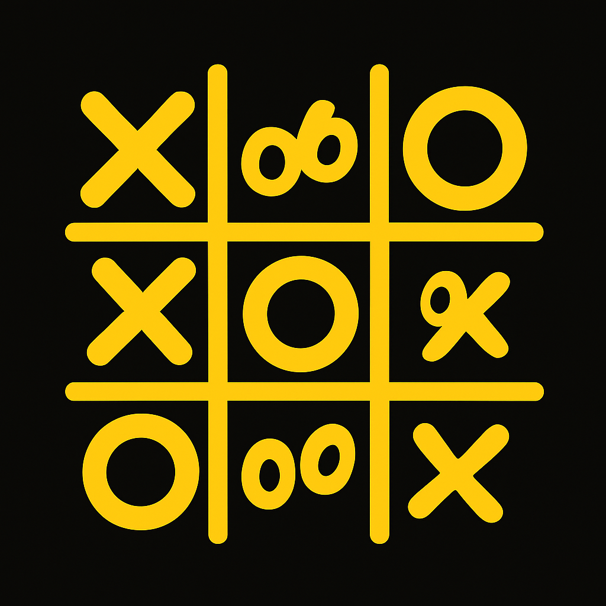

<p align="center">
  
</p>

# 🎮 tic tac toe game

a fun and simple tic tac toe game built with **html**, **css**, and **javascript** — no frameworks, just pure web magic and a lot of ❤️.

## 🧠 about the project

this is a browser-based implementation of the classic tic tac toe game. two players take turns marking spaces in a 3×3 grid, trying to get three in a row to win the game.

you can play with a friend! it's lightweight, responsive, and super easy to use — just open and play.

## 🚀 features

- clean and responsive layout
- Simple and intuitive gameplay
- pure html, css , js
- player name configuration
- game restart functionality
- visual feedback for game result (win, lose, draw)

## 🌐 live demo

🎮 play the game here: [https://gentle-torrone-8fb767.netlify.app/](https://gentle-torrone-8fb767.netlify.app/)

hosted for free with ❤️ on [Netlify](https://www.netlify.com/)

## 📁 project structure

```
tic-tac-toe/
├── assets/
│ ├── logo.png # game logo
│ └── favicon.png # browser favicon
├── styles/
│ └── style.css # css styling
├── .gitignore # ignored files for git
├── README.md # project documentation
├── index.html # main html file
└── script.js # game logic (js)
```

## 🛠️ how to run it

1. clone the repository:

   ```bash
   git clone https://github.com/raizy21/tic-tac-toe
   cd tic-tac-toe
   ```

   2. open index.html in your browser (no server required!): double-click `index.html`, or right-click and select open with your browser.

## 🙌 credits

built by [raizy21](https://github.com/raizy21) with lots of curiosity and love for the web 💻✨
